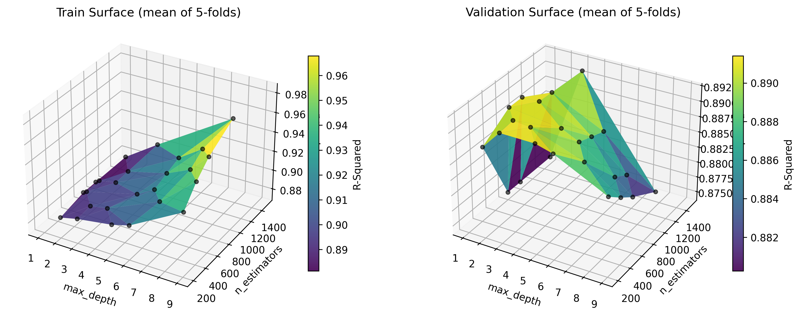
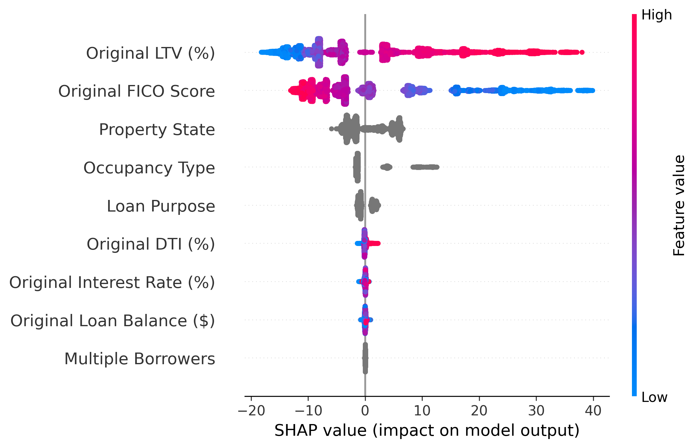
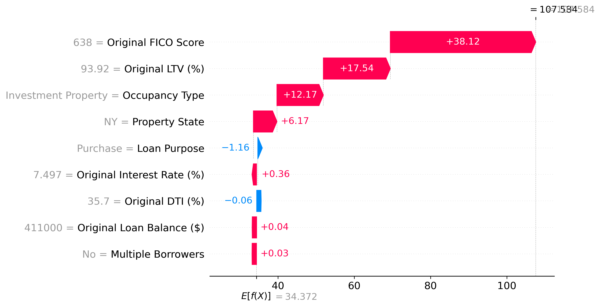

# XGBoost Mortgage Insurance Pricing - Explainable Machine Learning for Mortgage Insurance

## 1. Problem Motivation

Mortgage Insurance premiums are typically determined either by actuarial rate cards that depend on FICO and LTV buckets which may be based on GLM models. While this is easy to interpret, the approach fails to capture the non-linear interactions between risk factors and ignore the pricing signal in other borrowers characteristics like DTI, occupancy type, and property state. 

From my professional experience working with mortgage insurance products, I observed that traditional GLM-based approaches fail to capture the threshold effects and interaction terms between FICO and LTV. For example, the way FICO and LTV interact at specific pricing bands. This lead to the motivation to explore whether an XGBoost model could learn these patterns directly from data and whether SHAP could be used to make the predictions explainable enough for practical use.

Additionally, for mortgage reinsurers it is challenging to do rate change analysis especially on the proportional business since they are not aware of the pricing algorithm used by mortgage insurers. XGBoost can help reverse-engineer the pricing methodology and predict premium rates so that reinsurers can guage if rate changes are purely risk-driven or driven by the market forces.

---

## 2. Objective

To build an explainable Machine Learning framework for Mortgage Insurance rate estimation that:
- Captures non-linear interaction between risk factors of the mortgage that GLMs can not model explicitly
- Use SHAP analysis to explain predictions at both portfolio and individual loan level, making the model interpretable and practical

---

## 3. Data & Inputs

- Synthetic loan-level pool was curated with following features:
    - Original Loan Balance
    - Original FICO score
    - Original LTV ratio
    - Original DTI
    - Original Interest Rate
    - Loan Purpose
    - Occupancy Type
    - Property State
    - Multiple Borrowers Indicator
    - MI Premium Rate in bps

---

## 4. Modelling Approach

### Exploratory Data Analysis
- Distribution analyses of loan balances and premium rates that depict positive skewness with prime-heavy loan pool
- Average premium rate is bps by occupancy type and loan purpose to compare how premium rates vary by different categorical variables
- Weighted Average Premium Rates by FICO/LTV buckets showing non-additive interaction effects that motivate the use of XGBoost over a GLM
- Correlation matrix showing several features have low linear correlation with premium rates but may still carry non-linear predictive signal

---

### XGBoost Modelling
- Loan-level data split into train and test datasets with 80/20 ratio
- Dataset being cleaned by filling missing numerical values by averages and categorical values by most occurring values
- Categorical variables were encoded using category dtype and handled through tree-based splits within XGBoost
- Learning rate of the XGBoost model fixed at 0.05 and `RandomizedCVSearch` used to fit multiple XGBoost models with different `max_depths` and `n_estimators`
- 5-fold cross validation used to avoid overfitting. Best optimised XGBoost model selected by maximising $R^{2}$ on validation dataset
- Final XGBoost model selected by fixing learning rate at 0.05, `max_depth` and `n_estimators` taken from the model with maximum $R^{2}$ and minimum RMSE. 
- Plot residuals and actual vs predicted premium rates for validation

---

### SHAP Analysis for XGBoost Model
- `TreeExplainer` used to estimate SHAP values on the held-out test dataset
- Summary plot and bar plot to identify key drivers of premium rates at portfolio level
- Dependence plots for FICO and LTV to visualise threshold effects and interaction between the two primary risk factors
- Waterfall plots for a high-risk and low-risk loan to explain individual predictions 

---

## 5. Results & Visualisation

### Hyperparameter Selection

Validation R-squared peaks at max_depth of 3 to 4 before declining at higher depths, indicating overfitting as trees become too complex. The optimal parameters are selected at this peak to balance model fit and generalisation. Hence, final XGBoost model fit using `learning_rate` as 0.05, `max_depth` as 3, and `n_estimators` as 400. 

### Key Drivers of Prediction

High LTV values (pink dots) push premiums up significantly while low LTV pulls them down, and the opposite pattern holds for FICO where high scores reduce premiums. Property State and Occupancy Type show visible spread confirming they carry real pricing signal, though far smaller than the two primary factors. DTI, interest rate, loan balance and multiple borrowers are essentially flat, showing the model correctly treats them as weak signals.

### Waterfall Plot for a High-Risk Loan

This plot makes XGBoost model explainable for an individual loan. It shows how the final premium is decided based on an pool average premium of 34 bps and risk factors of the loan. FICO alone adds 37.9 bps above the average and LTV adds a further 17.5 bps. Being an investment property in New York adds 12.1 bps and 6.0 bps respectively, resulting in a final prediction of around 107 bps.

---

## 6. Key Insights

- The final model achieves the following on the held-out test dataset:

| Metric | Value |
|---|---|
| R-Squared | 0.89 |
| RMSE | 6.28 bps |
| MAE | 5.04 bps |

The model explains 89% of variance in MI premium rates with predictions on average within 5 bps of actual premiums.

- XGBoost learns FICO and LTV pricing thresholds at the standard MI bands (85, 90, 93, 95 LTV) purely from data without any explicit encoding, confirming the model captures real pricing structure
- Within each FICO band, higher LTV loans attract higher premiums and vice versa, the model correctly identifies the interaction between the two primary risk drivers
- Property State and Occupancy Type carry real pricing signal as secondary factors, something a simple rate card approach would miss
- The SHAP waterfall plots show predictions are fully decomposable to individual feature contributions, making the model interpretable enough for practical pricing applications
- Residuals show slight heteroscedasticity at high predicted values, reflecting that high-risk loans have greater inherent pricing variability that the model cannot fully capture

---

## 7. Limitations

- The model does not consider the underwriting year in which these loans are priced since that would determine the changes in pricing due to changes in risk environments
- The model does not explicitly model prepayments or defaults, meaning the premium rates are point-in-time and do not capture lifetime exposure
- The model does not explicitly separate defaults and severity and directly models premium rates. A better approach may be to model defaults using XGBoost and severity using a HPI based time series model. 

---

## 8. Repository Structure

- `01_ExploratoryDataAnalysis` — Exploratory data analysis to check distributions of premium rates and show interaction effects that motivate to fit an XGBoost  
- `02_XGBoostModel` — Fitting the XGBoost model
- `03_SHAPAnalysisXGBoost` — Explainable XGBoost using TreeExplainer  

---

## 9. Takeaway

The project shows that XGBoost can learn the non-linear pricing structure of mortgage insurance directly from loan-level data, including threshold effects and interaction terms that GLMs require explicit feature engineering to capture. Combined with SHAP, the model is interpretable at both portfolio and individual loan level, addressing the key practical barrier to ML adoption in insurance pricing.

---

## Libraries

`numpy` `pandas` `matplotlib` `statsmodels` `scipy` `shap` `sklearn`

## How to Run

Run the notebooks in order: `01` → `02` → `03`. Notebook 03 imports functions from notebooks 01 and 02 `import_ipynb`.